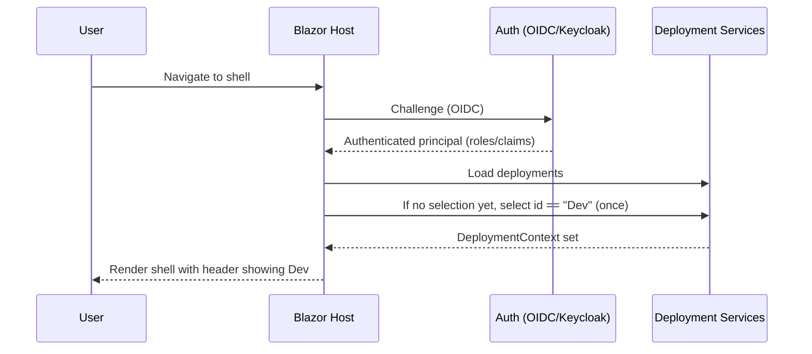

# Architecture

## Overall Technical Approach
- **UI framework**: Modular Blazor Server application hosted by `UKHO.ADDS.Management.Host`.
- **AuthN/AuthZ**: OIDC (Keycloak) for authentication, cookie session for the Blazor Server UI, RBAC based on role claims mapped to `ClaimTypes.Role`.
- **Routing**: Blazor `<Router>` using `AuthorizeRouteView` to enforce authenticated access and provide custom handling for unauthorized and not-found routes.
- **Deployment selection**: Header selector backed by `DeploymentsJsonLoader`, `DeploymentSelectionStorage`, and `DeploymentContext`.

Proposed high-level flow (login to ready state):

## Frontend

### Key UX requirements
- **Default deployment selection**: On first authenticated session, selected deployment defaults to `Dev`.
- **Developer-only diagnostics**: A `Development` page exists only for users with `developer` role.
- **Safe navigation**:
  - Unauthorized direct URL -> redirect to `/`.
  - Unknown route -> redirect to `/`.

### Pages and components (expected)
- Shell host project
  - `App.razor` (router)
    - Handles `Found` via `AuthorizeRouteView`.
    - Handles `NotFound` via redirect to `/`.
    - Handles `NotAuthorized` via redirect to `/`.
  - Header component
    - Shows deployment dropdown bound to `DeploymentContext` and persists via `DeploymentSelectionStorage`.
- Developer module (renamed from Sample)
  - All pages annotated with `[Authorize(Roles = "developer")]`.
  - `Development.razor`
    - Renders diagnostics (roles/claims) that were previously present on Home.

## Backend

No new backend services or persistent data changes are introduced by this work package.

Backend-adjacent concerns (in the shell host):
- Claims mapping must yield role(s) including `developer` where appropriate.
- Any downstream HTTP calls from the UI should continue bearer token forwarding as currently implemented.

## Testing Strategy (WP003)
- Prefer unit tests for service-level logic (deployment selection, navigation filtering).
- Prefer Playwright end-to-end tests for UI behaviours:
  - Deployment dropdown defaults to `Dev` after login.
  - Developer module navigation visibility differs for developer vs non-developer.
  - Unauthorized routes and unknown routes redirect to `/`.
